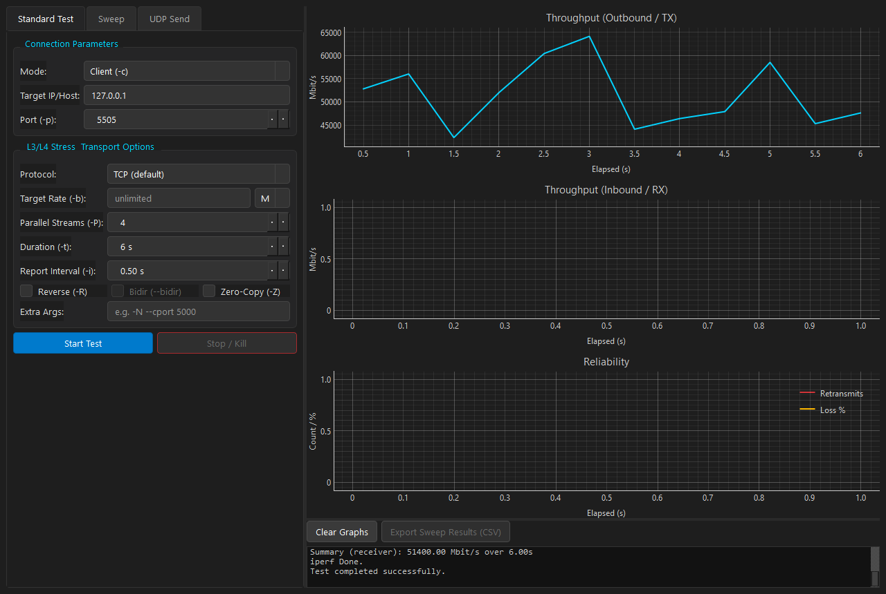
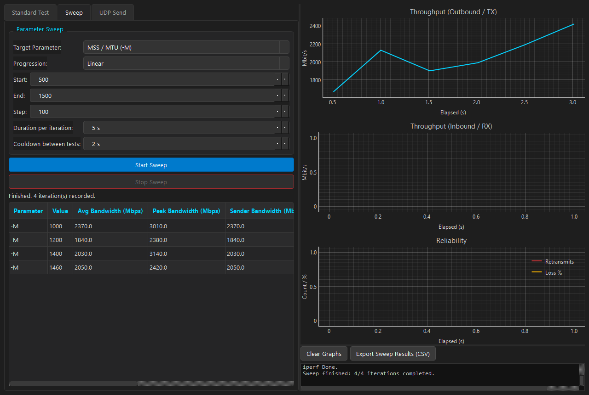
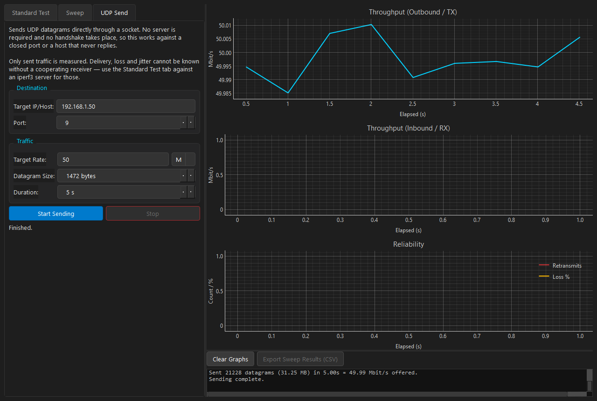

<h1 align="center">iperf3 Advanced GUI &amp; Sweeper</h1>

<p align="center">
  A desktop front-end for <a href="https://iperf.fr/">iperf3</a> with live throughput charts,
  an automated parameter sweeper, and a serverless UDP traffic generator.
</p>

<p align="center">
  <a href="https://github.com/AlexRudyak/iperf3-gui/releases/latest">
    
  </a>
  <a href="https://github.com/AlexRudyak/iperf3-gui/actions/workflows/tests.yml">
    
  </a>
  <a href="LICENSE">
    
  </a>
  
  
</p>

<p align="center">
  
</p>

---

## Contents

- [Features](#features)
- [Download](#download)
- [Screenshots](#screenshots)
- [Sending UDP without a server](#sending-udp-without-a-server)
- [Getting iperf3](#getting-iperf3)
- [Running from source](#running-from-source)
- [Testing](#testing)
- [Building a Windows executable](#building-a-windows-executable)
- [Architecture](#architecture)
- [Logging](#logging)
- [Licence](#licence)

---

## Features

| | |
|---|---|
| **Standard tests** | Client or server mode, TCP/UDP/SCTP, target bitrate, parallel streams, reverse and bidirectional modes, plus a free-form field for any other `iperf3` switch. |
| **Live telemetry** | Separate outbound and inbound throughput plots, and a reliability plot for TCP retransmits and UDP datagram loss. The time axis comes from the intervals `iperf3` reports, so it stays correct at any `-i` setting. |
| **Parameter sweeps** | Step `-M`, `-w`, `-l` or `-P` through a linear, exponential or explicit series, running one test per value with a configurable duration and cooldown. Results fill a table as each iteration completes. |
| **UDP Send** | A connectionless traffic generator that needs **no server at all** — see [below](#sending-udp-without-a-server). |
| **CSV export** | Choose exactly which columns to write. |
| **Capability detection** | The app probes your `iperf3` at startup and disables anything that build cannot do, instead of offering it and failing mid-run. |
| **Actionable errors** | A failed test reports *why*, with a suggested remedy — not just an exit code. |

---

## Download

> [!TIP]
> **[Download the latest release →](https://github.com/AlexRudyak/iperf3-gui/releases/latest)**
>
> A single `iperf-gui.exe`. No installer, no Python, `iperf3` bundled.

> [!NOTE]
> The executable is unsigned, so Windows SmartScreen warns on first run.
> Choose **More info → Run anyway**, or verify the SHA256 checksum published
> in the release notes.

---

## Screenshots

### Standard test

A TCP run with four parallel streams against a local server.


<details>
<summary><b>Parameter sweep</b> — one test per value, with live results</summary>

<br>

Sweeping the MSS (`-M`) across four values. Each iteration runs independently;
the table fills as results arrive, and the final iteration's trace stays on the
chart when the sweep ends.



</details>

<details>
<summary><b>UDP Send</b> — traffic generation with no server</summary>

<br>

Sending 50 Mbit/s of UDP at a host that is not running `iperf3` — something
`iperf3` itself cannot do. Only offered load is measured; loss and jitter are
reported as unknown rather than invented.



</details>

---

## Sending UDP without a server

`iperf3` cannot send traffic to a host that is not running `iperf3`. It
negotiates every test over a **TCP control connection** and derives its figures
from what the *receiver* reports, so with nothing listening it fails before a
single datagram leaves the machine:

```console
iperf3: error - unable to connect to server: Connection refused
```

> [!IMPORTANT]
> That is a constraint of **iperf3**, not of **UDP**. UDP is connectionless —
> datagrams can be sent to a closed port, or to a host that never replies.

The **UDP Send** tab does exactly that, through a plain socket with no `iperf3`
involved. Use it to exercise a firewall rule, load a device that is not an
iperf3 server, or simply confirm packets leave the interface.

| | Standard Test (iperf3) | UDP Send |
|---|:---:|:---:|
| Needs a server | Yes | **No** |
| Handshake | TCP control connection | None |
| Measures throughput | Yes | Offered load only |
| Measures loss / jitter | Yes | **No — unknowable** |

> [!WARNING]
> Loss and jitter are reported as **unknown**, not zero. Without a cooperating
> receiver there is no way to learn what arrived, and showing `0%` would be a
> fabrication. For those figures, run an iperf3 server and use the Standard
> Test tab.

<details>
<summary>Why a UDP test still shows TCP packets in Wireshark</summary>

<br>

Because `iperf3` negotiates over TCP on the server port and carries only the
*payload* over the selected transport. Capturing on port 5201 therefore shows a
TCP handshake and control traffic during a UDP run.

Filter on the data, not the control channel:

```
udp.port == 5201
```

A genuine UDP run is confirmed by iperf3's own output, which reports `Jitter`,
`Lost/Total Datagrams` and `Sent N datagrams` — none of which appear for TCP.

</details>

---

## Getting iperf3

`iperf3` is a third-party binary with its own licence, so it is deliberately
**not tracked in this repository**. The released `.exe` bundles one; from
source, provide it in either of two ways:

1. **Next to the project** — place `iperf3.exe` (and the DLLs it links against)
   in the repository root. This is what the PyInstaller build bundles.
2. **On your `PATH`** — the app falls back to a `PATH` lookup and logs a warning
   when no local copy is found.

Download a Windows build from [software.es.net/iperf](https://software.es.net/iperf/),
and copy the `.exe` together with every DLL in the same archive.

If no binary is available the app still starts; it reports the problem in the
console and tests fail until one is provided.

### Version matters

The app probes the binary at startup and disables anything it cannot do, so a
newer `iperf3` unlocks more features with **no code change**. Against
**iperf 3.1.3** — the Cygwin build this project was developed against, and the
one bundled in the release — the following are unavailable:

| Feature | Requires | Status on 3.1.3 |
|---|---|---|
| `--bidir` (bidirectional) | iperf3 ≥ 3.7 | Unavailable |
| `--sctp` | an SCTP-enabled build | Unavailable |
| `Retr` (retransmit) column | a build reporting TCP_INFO | Not reported |
| UDP with `-P` > 1 | iperf3 ≥ 3.2 | Hangs; use **Stop** to cancel |

> [!TIP]
> **Use iperf3 3.17 or newer** to enable all of the above. Drop it next to the
> executable and restart — detection is automatic.

---

## Running from source

```bash
pip install -r requirements.txt
python main.py
```

Assets resolve relative to the package, so the app can be started from any
working directory.

## Testing

```bash
python -m pytest
```

210 tests covering parsing, configuration, sweeps, export, the UDP sender and
the widgets. No display is required — the GUI tests run on Qt's `offscreen`
platform. Tests needing the `iperf3` binary skip themselves when it is absent.

## Building a Windows executable

```bash
build_exe.bat
```

Runs the test suite, then builds `dist\iperf-gui.exe` from
[`main.spec`](main.spec). All bundle options live in the spec file — the batch
script only invokes it, so the two cannot drift apart.

---

## Architecture

The codebase splits into a Qt-free domain layer and a presentation layer.
Nothing in `core/` imports from `ui/`, so the entire domain is testable without
a running `QApplication`.

```
main.py                       Entry point: logging, stylesheet, window

iperf_gui/
├── core/                     Domain layer — no Qt widgets
│   ├── config.py             IperfConfig: validation and argument building
│   ├── metrics.py            Sample / IterationResult value objects
│   ├── capabilities.py       Probes the binary for supported features
│   ├── parser.py             iperf3 stdout → Sample
│   ├── engine.py             IperfWorker: runs one test on a QThread
│   ├── udp_sender.py         Serverless UDP traffic generator
│   ├── process.py            Cross-platform subprocess helpers
│   ├── export.py             CSV writing
│   └── sweep/
│       ├── engine.py         SweepEngine: sequences iterations
│       └── strategies.py     Linear / Exponential / Explicit value series
│
├── ui/                       Presentation layer
│   ├── main_window.py        Composition and signal wiring only
│   ├── dashboard.py          Throttled pyqtgraph plots
│   ├── fuzzer_tab.py         Sweep configuration, progress and results
│   ├── udp_tab.py            UDP Send tab
│   ├── dialogs.py            CSV column picker
│   ├── panels/               Connection and options panels
│   └── widgets/              Bounded log console, results table
│
└── utils/
    ├── paths.py              Resource resolution (source and frozen builds)
    └── logging_setup.py      Rotating file log + exception hook
```

<details>
<summary><b>Data flow</b></summary>

<br>

```
Panels  ──build──▶  IperfConfig  ──to_args()──▶  IperfWorker (QThread)
                                                       │
                                                  iperf3 stdout
                                                       │
                                                  IperfParser
                                                       │
                                      ┌────────────────┴────────────────┐
                                 sample_ready                    summary_ready
                                      │                                │
                              TelemetryDashboard                 SweepEngine
                              (throttled repaint)              (aggregates rows)
```

A sweep wraps the same worker: `SweepEngine` substitutes each value into the
base config, runs one `IperfWorker` per iteration, and aggregates the result
from the closing summary block.

The UDP Send tab bypasses this entirely, driving a socket directly.

</details>

<details>
<summary><b>Design notes</b></summary>

<br>

**Configuration is a value object.** `IperfConfig` is an immutable dataclass
that validates itself and renders its own argument vector. The widgets only
read values into it, so the CLI vocabulary has one definition and can be tested
without Qt. Client-only switches are never emitted in server mode, where
`iperf3` rejects them.

**Parsing is positional and stateful.** `iperf3`'s columns are not labelled on
data rows, so the retransmit count is read by position — searching for the word
`Retr` only ever matches the header. Live interval rows are told apart from the
closing summary by three combined signals: a separator followed by a column
header, an explicit `sender`/`receiver` tag, and the interval restarting at
zero. No single signal suffices — the `- - - - -` separator prints after
*every* interval group once `-P > 1`, and the UDP client summary carries no tag
at all. `[SUM]` rows are filtered against per-stream rows so parallel runs are
not double-counted.

**Sweep progressions are strategies.** Adding a progression means adding a
`SweepStrategy` subclass, not another branch in the engine.

**Thread ownership is explicit.** Workers are parented to their owner and
reclaimed via `finished` → `deleteLater`; the window's `closeEvent` stops any
running test and waits for it, so closing mid-test cannot destroy a live
`QThread` or orphan an `iperf3` child.

**Unknown is not zero.** Metrics a given build or mode cannot report — the
`Retr` column on a Cygwin build, loss on a serverless UDP send — are carried as
`None` and rendered as `-`, never as `0`.

</details>

---

## Logging

A rotating log, including unhandled exceptions, is written to the per-user data
directory — which matters for the windowed build, where there is no console:

| Platform | Path |
|---|---|
| Windows | `%LOCALAPPDATA%\iperf_gui\iperf_gui.log` |
| macOS | `~/Library/Application Support/iperf_gui/iperf_gui.log` |
| Linux | `~/.local/share/iperf_gui/iperf_gui.log` |

---

## Licence

Licensed under the **GNU General Public License v3.0 or later** — see
[LICENSE](LICENSE).

GPL-3.0 is the licence this project can actually adopt: it links against PyQt6,
offered under the GPL v3 or a commercial Riverbank licence, so a permissive
licence would not be compatible with distributing a PyQt6-based binary.

Third-party components carry their own terms — see
[THIRD_PARTY_NOTICES.md](THIRD_PARTY_NOTICES.md), which also covers the LGPL
obligations that attach if you distribute a build bundling the Cygwin runtime.
